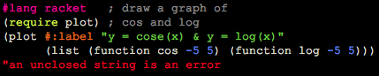

Cyberpunk for DrRacket
==================================

This package adds a Cyberpunk colorscheme to DrRacket, the IDE
of the [Racket programming language](http://www.racket-lang.org).
It is inspired by the Cyberpunk theme for emacs (available from
https://github.com/n3mo/cyberpunk-theme.el).

Note: colorschemes are only supported on [Racket 6.0](http://download.racket-lang.org/racket-v6.0.html)
and newer versions.

Installation
------------

From the package catalog:

  * `raco pkg install drracket-cyberpunk`

Directly from github:

  * `raco pkg install git://github.com/thinkmoore/drracket-cyberpunk`

License
-------

Distributed under the GNU public license. See the COPYING file.
